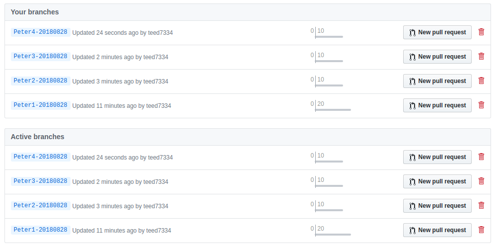
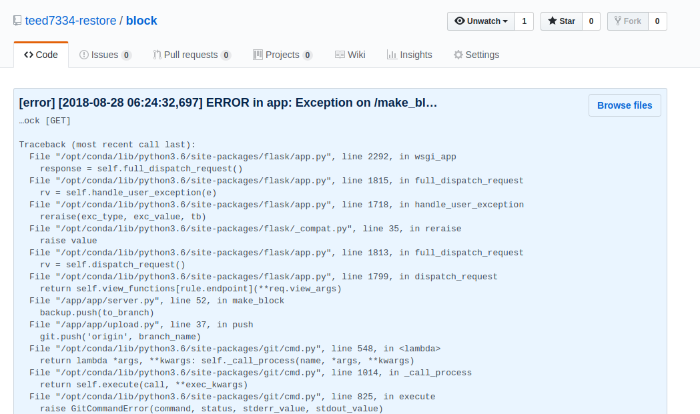

# gitchain
雞塊鏈-一個基於Git的點對點日誌系統

## 環境需求

一台可以跑Docker的電腦，如果用Windows，在Powershell底下跑不了.sh檔的話，請自行修改.sh檔，本人都在Linux底下工作

一個Github帳號，本系統是透過Github進行測試開發，但URL沒有寫死，如果要用其他Git線上服務可以自己做測試

## 環境架設

1. 先到以下[這裡](https://github.com/teed7334-restore/block)將整個git硬分岔到你自己的git空間
2. 將.env.swap改成.env
3. 設定.env可以參考以下設定
   ```
   URL="https://github.com/teed7334-restore/block.git"

   USERNAME="teed7334@gmail.com"

   PASSWORD="12345678"

   DIRECTORY="block"

   NODE="Node1"
   ```
4. 進入dev_env資料夾
5. 透過./compilerGitChain編譯Git Image
6. 透過./gitchain.sh啟動容器
7. 在容器裡輸入FLASK_APP=app/server.py flask run --host 0.0.0.0 --port 80，起動RestFul Service
8. 透過CURL打[Your IP or Domain Name]/, 建立創世區塊
9. 當系統發生問題之後，可以將日誌資訊打到[Your IP or Domain Name]/write，日誌需符合以下格式
    ```
    create_at: [新增日期]
    level: [日誌等級，好比info、error、warn等等]
    content: [日誌內文]
    ```
10. 請自行設定上鏈的時間，如果沒有上鏈資料就不會打到遠端的Git Brnach去，設定上鏈可以打[Your IP or Domain Name]/make_block

## 原理說明
本系統在第一次新增創世區塊時，會在本地新增一個資料夾，供存放git資料時用，資料夾預設是叫block，除非您在.env中有做過其他設定，不然一般來說會是這個

當伺服器將日誌打過來時，系統會在git資料夾中，透過uuid動態新增一個空檔案，為了騙git有資料變動之用，而git commit的內容會是以下格式
```
[日誌等級] [日誌內容] [新增日期]
```

您也可以透過修改app/log.py中的write_log裡面的內容，修正它的格式

當git commit成功之時，本系統為了體貼您的儲存空間，會自己刪除新增的空檔案，如果您可以在git資料夾中看見任何檔案，代表之前系統在運行時有出錯過，所以才有資料未被刪除

最後，我們需要將日誌的資料上鏈，也就是透過git push打到Git遠端Branch去，這時，為了不影響同時間git commit的運行，系統會很貼心將git的資料夾重新clone一份，clone的資料夾名字是UUID動態產生的，接下來系統會進入那一個新clone的資料夾中，進行Git Push，當我們的資料成功上鏈之後，系統會自己將Clone出來的資料夾自己刪除，完全不額外佔用您寶貴的儲存空間

本系統會每天新增一個以下格式的branch，讓您的branch不會因為commit的資料太多而爆掉
```
[Node名稱]-[日期格式YYYYMMDD]
```

如果您希望修改它的Branch名稱，可以透過修改app/server.py中的get_default_branch_name裡面的內容

## 日誌介接環境
建議一個服務，對應一個雞塊鏈，多個雞塊鏈可以用同一個Git線上服務，但記得.env檔中，NODE的設定每個雞塊鏈要不一樣，本系統沒有Git Merge失敗的共識判別機制，盡可能讓每個服務的日誌都存放在不同的Branch

可以的話，透過Celery將工作排好隊扔給雞塊鏈會比較好，git是不能同時間二筆含以上的git commit的，排好隊比較不會發生問題

## 運行結果
Git Commit 列表


Git Commit 內文


## 贊助 & 共同開發
如果您覺得作者設計得不錯，有幫助到您解決分散式日誌存放的問題，您可以透過將比特幣打到以下位址支持作者


3HkYa3x3ezyppFXn27jKg2g4BUFDpU7kCk

如果您希望加入Core Team(目前只有作者一人)，可以透過EMail通知作者

teed7334@gmail.com